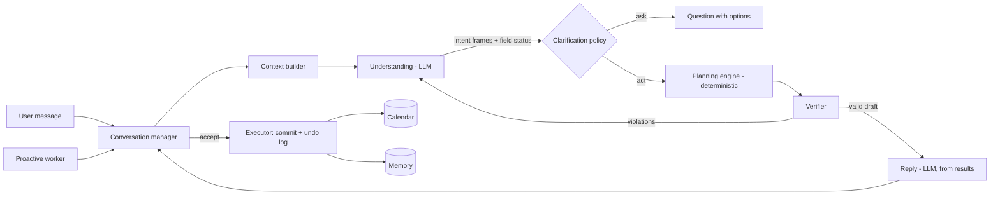

# Find time — AI planner plan

How Find time becomes a planner that *understands*: it listens, asks the one
question that matters, proposes a whole plan with reasons, takes pushback in
plain language, remembers what it is taught, and checks back in. The scheduler
stays deterministic underneath, so every plan is actually feasible.

Written 2026-09-14. Nothing past Phase 0 is built. Supersedes the shorter
version of this file (commit `25c05b6`).

Related: [ai-learning.md](ai-learning.md) (how the agent learns),
[training-capture.md](training-capture.md) (what every turn logs),
[db/calendar-schema.md](db/calendar-schema.md).

---

## 0. What good looks like

Today is Monday. Tuesday is full of calls; the user leaves for Copenhagen
Thursday 18:00.

> **You:** Thesis draft due Thursday, probably 10 hours left. Gym three times
> this week. And I'm in Copenhagen from Thursday evening till next Tuesday.
>
> **Find time:** *(reads the calendar, open tasks and what it knows about you)*
> Before I build the week — do you write better in the mornings or the
> afternoons? `Mornings` `Afternoons` `Doesn't matter`
>
> **You:** mornings. gym can be evenings
>
> **Find time:** Here's the week *(ghost blocks on the calendar)*.
> - Thesis: Mon, Wed, Thu 08:30–11:00 and Tue 07:30–10:00 — 10 hours, done
>   Thursday before you leave.
> - Gym: Mon and Wed 18:30. The third doesn't fit: Tuesday your calls run to
>   19:00 and Thursday you're travelling. `Tue 07:00 instead` `Skip it this week`
> - Copenhagen: blocked Thu 18:00 → Tue 18:00.
> - I kept writing sessions to 2.5 hours, because longer ones are the ones you
>   usually cut short.
> `Accept the week` `Change something`
>
> **You:** skip the third gym. and I hate Monday mornings actually
>
> **Find time:** Moved Monday's session to Wednesday 14:00, still 10 hours by
> Thursday. Should I remember "no deep work on Monday mornings"?
> `Yes, always` `Just this week`
>
> **You:** always
>
> **Find time:** Saved. The week is on your calendar — `Undo`.
>
> *Wednesday 09:40, as a colleague adds a 10:00 call over the writing
> session:* Your 10:00 call cuts an hour off this morning's writing. I can add
> it to Thursday 11:00 — still done before you leave. `Move it` `Leave it`

Everything in that exchange is a requirement below: reading intent that is
never stated as a command, asking only where the answer changes the plan, a
feasible plan with its trade-offs visible, revisions in plain language,
learning offered rather than assumed, undo, and a proactive fix when reality
changes.

---

## 1. Market position

Checked 2026-09-14. Several sources are vendor or competitor pages; none
measures how well a product understands plain language.

| Product | Strength | Limit |
|---|---|---|
| Motion | Tasks with deadline + estimate auto-placed, split into chunks, re-planned as the calendar changes, over-capacity warnings. Also sells general "AI Employees". | Planning is form-driven; per Reclaim's comparison, no dedicated conversational assistant for reviewing plans |
| Reclaim | Tasks (total duration, min/max session, due date, earliest start), flexible habits, Google + Outlook. **Has a conversational assistant** and ChatGPT / Claude (MCP) integrations. | The assistant explains and manages; planning itself is still field-based |
| Morgen | AI planner suggests an editable day | Suggests; little dialogue |
| Akiflow / Sunsama | Manual daily planning | Little or no AI |
| Gemini in Google Calendar | Chat creates events, suggests meeting times across calendars | No task planning over days |
| Copilot in Outlook | Books meetings, rooms, invites; RSVP and focus-time rules | Meetings and rules, not multi-day plans |
| Clockwise | Shut down 2026-03-27 | — |

**A chat box is not a moat** — Reclaim already has one. What nobody shows is
*depth*: a planning conversation that asks the right question, negotiates what
does not fit, revises a whole plan from a sentence, checks back in, and learns
from all of it — on a privacy-first footing. That is the product.

**The architecture the leaders share is sound and Find time already has it:**
work is described, a deterministic scheduler places it. Keep that; put the
understanding on top of it, not instead of it.

---

## 2. What is true today (verified in code and data)

- **Events are single-day.** `CalEvent` is a date plus start/end clock times
  (`src/calendar/types.ts`, `api-adapter.ts` `isoToParts`); length is
  `toMin(end) - toMin(start)`. All-day and multi-day events render as zero
  length on their first day. `calendar_events.all_day` exists (db/003) but
  `events-repo.ts` never selects it. Time off is split per day as a workaround
  (`src/server/ai/time-off.ts`, commit `c315dd3`).
- **The agent is one-shot.** One forced function call per message
  (`gemini.ts`, `mode: 'ANY'`): it cannot look, act, then confirm, so tool
  descriptions carry all the guidance and the prompt is long.
- **Planning is narrow.** `propose_blocks`: one title and category, 1–5
  blocks, 15–480 min, each inside one day, within 21 days.
- **Asking is ad hoc.** `ask_clarification` exists, but when to ask is left to
  the model with no policy, no solver-backed options, and answers are free text.
- **Memory is thin.** Last 16 messages of the open conversation; hard rules
  (weekday/hour windows); inferred preferences after ≥3 pieces of evidence.
  Nothing across conversations. On 2026-09-14: 0 rules, 0 preferences,
  0 recorded decisions.
- **Every new action needs a migration** (`ai_turns.action` CHECK, db/016, db/018).
- **Google is read-only and not importing.** Pull-only sync; no write-back;
  the connected account reports `live` with 5 calendars yet 0 imported events
  — not yet investigated.

---

## 3. Principles

1. **Understand the person, not the words.** "I'm in Copenhagen from Thursday"
   is time away; "big presentation Friday" probably means prep time; "I'm
   wiped" means a lighter plan.
2. **The model judges; code guarantees.** The model decides what the user
   means, what matters, what to ask and how to trade things off. Code decides
   whether a plan is feasible and writes it. Every plan — the solver's or one
   the model suggests — passes a verifier, and failures go back to the model as
   feedback (the LLM-Modulo pattern: LLMs plan poorly alone but well inside a
   generate → verify → revise loop).
3. **Ask when the answer changes the plan; otherwise assume out loud.** One
   question at a time, with real options and a default.
4. **Plans are drafts until accepted.** Direct commands ("block my vacation")
   act immediately, with undo.
5. **Never claim what did not happen.** The reply is written after the tools
   ran, from their results.
6. **Learn visibly.** Offer to remember; show what is remembered; let it be
   edited or forgotten.
7. **Change as little as possible.** Re-plans move the fewest blocks.
8. **Be honest about limits.** "I can't move other people's meetings" beats a
   workaround the user did not ask for.

---

## 4. Architecture

| Component | Owns | Implemented as |
|---|---|---|
| Conversation manager | Turn state: idle → awaiting answer → reviewing draft → committed; the pending question; the active draft | Server, per session |
| Context builder | Calendar window, tasks, relevant memory, recent outcomes, conversation summary — only what this intent needs | Code |
| Understanding | Intent frames, field status, interpretations, references ("that", "my gym") | LLM, structured output |
| Clarification policy | Ask or assume; which question; options | Code + solver, phrased by LLM |
| Planning engine | Placement, sessions, deadlines, unplaced items, trade-off options, explanations | Pure TypeScript |
| Verifier | Hard constraints on any plan | Pure TypeScript, independent of the engine |
| Reply | What to say, grounded in engine results | LLM |
| Executor | Commit draft, undo, write calendar (later Google) | Code, idempotent |
| Memory | Facts, rules, preferences, summaries, outcomes | DB + retrieval |
| Proactive worker | Check-ins, conflict alerts, deadline risk, briefs | Background job |

---

## 5. Understanding

### 5.1 Intent frames

The model turns each message into one or more frames. A message can hold
several ("thesis due Thursday, gym three times, Copenhagen from Thursday").

| Frame | Fields |
|---|---|
| `time_away` | start, end, label, allDay, travel buffer? |
| `fixed_event` | title, start, end, recurrence? |
| `task` | title, total minutes *or* sessions × length, min/max session, earliest start, deadline, priority, energy (focus/light), category, splittable |
| `habit` | title, times per period, duration, window, allowed days |
| `change` | target selector ("everything Wednesday", "the gym one", "my trip"), operation (move / shorten / extend / cancel / swap), destination |
| `preference` | statement, scope, hard/soft, duration (this week / always) |
| `state` | "sick", "overwhelmed", "deadline moved" — drives re-planning intensity |
| `question` | what they want to know about their schedule or a past decision |

### 5.2 Every field carries a status

`stated` (user said it) · `inferred` (from memory, context or a default — with
its source) · `unknown`. Code will not execute a frame with an `unknown`
required field; inferred values are listed in the reply's "I assumed" line.

### 5.3 Defaults (so time of day is never a question)

| Phrase | Default |
|---|---|
| morning / afternoon / evening / end of day | 09:00 / 13:00 / 18:00 / 18:00 |
| due "Thursday" | Thursday 17:00 |
| "this week" / "next week" | through Sunday / next Monday–Sunday |
| bare date range | whole days, last day included |
| session length | learned block length, else 60–120 min |
| "every" / "three times a week" | a habit, not three tasks |

Learned facts override defaults ("you start at 10").

### 5.4 Reading between the lines

- A presentation or exam → offer prep time (ask once; remember the answer).
- A trip → offer travel buffers the first time; remember.
- "I'm exhausted", "sick today" → propose a lighter plan, protect breaks, move
  what can move.
- "The deadline moved to Monday" → re-plan that task only.
- Mixed language ("nächste Woche", "Donnerstag") is understood like English.

### 5.5 References

"That", "the gym one", "my trip", "everything on Wednesday" resolve to a
selector over the calendar and the active draft. One match → act. Several →
ask, with the matches as the options. None → say so.

---

## 6. Asking well

LLMs recognise ambiguity but rarely ask; and when they do ask, using the answer
correctly is its own failure point. So asking is a policy in code, not a hope in
the prompt.

### 6.1 When to ask

Ask only if at least one holds:

1. A required field is `unknown` and has no default.
2. **Plausible readings produce materially different plans** — different days,
   a shift of more than an hour, a different task dropped. The model lists the
   readings; the engine solves each (cheap); if the plans differ materially,
   ask, with those plans as the options. This is the expected-value-of-
   information idea made concrete by the solver.
3. A trade-off the user has to own: something does not fit, a hard rule would
   be broken, a deadline is at risk.
4. The action is destructive or bulk (cancel a trip, clear a day, move more
   than 3 blocks).

Otherwise assume, act, and state the assumption in one line.

### 6.2 How to ask

- One question per turn, short, in the user's terms.
- Options come from real alternatives (the plans in 6.1), each with a
  structured payload, plus free text.
- Carry a default: "I'll go with mornings unless you say otherwise."
- A chip answer maps to frame fields deterministically; a free-text answer goes
  back through understanding for that one field.

### 6.3 After the answer

Apply it, re-plan, and if it is durable ("mornings are better for writing")
offer once to remember it. Never re-ask something memory already knows.

### 6.4 Anti-patterns to test against

Asking for time of day; stacking questions; asking and then ignoring the
answer; asking what the calendar already shows; asking instead of stating a
trade-off with a recommendation.

---

## 7. The plan conversation

### 7.1 Draft

A plan is shown whole: ghost blocks on the calendar plus a card — what was
placed, what did not fit and the options for it, what was assumed, what
conflicts. Actions: `Accept`, `Accept some`, or keep talking.

### 7.2 Revise in plain language

"Gym in the evenings", "thesis matters more than admin", "Wednesday is too
packed", "skip the third one" → `change` / `preference` frames applied to the
draft's constraints → re-solve with minimal change → show a diff ("moved 2,
shortened 1, dropped 1").

### 7.3 Negotiate what does not fit

The engine returns unplaced work with the cheapest ways to make it fit: extend
the deadline, shorten the total, use the weekend, drop or shrink a lower-
priority item, shorten sessions. It never proposes moving other people's
meetings. The model picks the best two and asks with a recommendation.

### 7.4 Explain

"Why Tuesday?" is answered from the engine's own reasons (the scoring notes in
`scoring.ts`), never invented.

### 7.5 Commit and undo

Commit writes every block, linked to the draft; `Undo` reverts the whole commit.
Outcomes (accepted, edited, removed) feed learning.

---

## 8. Planning engine v2 (deterministic)

**Entities:** fixed events, time away (all-day / multi-day), tasks, habits,
buffers, travel.

**Hard constraints:** no overlap with busy time; working windows and hard
rules; time away; deadlines; min/max session; locked (imported, accepted,
started) blocks.

**Soft constraints (scored):** learned preferences, energy fit (focus work in
the user's best hours), fragmentation, spreading sessions, buffers, and a
penalty for moving anything already placed.

**Algorithm:**

1. Place fixed events and time away.
2. Place habits into their windows.
3. Place tasks earliest-deadline-first, weighted by priority and slack; size
   sessions within min/max; score candidate slots with the existing
   `rankFreeSlots`.
4. Repair: local swaps to cut fragmentation and respect energy fit.
5. Whatever still does not fit → `unplaced` with the reason, plus trade-off
   options generated by relaxing one constraint at a time.

**Re-planning** pins accepted and started blocks and minimises moves.
**Horizon** follows the furthest deadline, capped at 8 weeks. **Verifier** is a
separate pure function that checks any plan against the hard constraints.
**Budget:** a week plan under 200 ms. Stay in TypeScript with `.check.mjs`
coverage; consider a constraint solver (e.g. OR-Tools as a service) only if
the heuristic fails the evaluation set.

---

## 9. Memory and learning

| Kind | Example | Written when | Used as |
|---|---|---|---|
| Facts | "Starts work at 10", "gym Mon/Wed/Fri" | The user says it and agrees to remember | Defaults, context |
| Rules | "Nothing before 10" | Stated as a rule | Hard constraints |
| Preferences | "Writing sessions ≤ 2.5 h" | Inferred, ≥3 pieces of evidence (existing learner) | Soft scores; never stated as fact |
| Summaries | "Planned thesis week; skipped third gym" | End of each conversation | Context for the next |
| Outcomes | "Thursday session done / skipped" | Check-ins, calendar edits | Learning, re-planning |

- A **"What Find time knows about you"** screen: every item with its source
  ("you told me on 14 Sep"), editable and deletable.
- The context builder retrieves only what the current intent needs.
- Learning signals: accept / edit / reject, plain-language corrections,
  question answers, check-in outcomes.

---

## 10. Proactive behaviour (opt-in)

- **Conflict alert:** a new meeting lands on planned work → propose the fix.
- **Deadline risk:** remaining work no longer fits → say so early, with options.
- **Check-in:** end of a work block or day — "did it happen?" — and move what
  did not.
- **Morning brief** and a **weekly planning prompt**.

Limits: a daily cap, quiet hours, one tap to act, and accepted plans never
change without consent (unless the user enables auto-re-planning of flexible
blocks). Needs a background worker and notifications (`notifications` table,
db/005).

---

## 11. Agent runtime

- **Loop** with a step budget (~6): understand → (ask | solve → verify →
  revise) → reply. Replaces the one forced call.
- **Tools:** `get_context`, `list_events`, `list_tasks`, `recall`,
  `solve_plan`, `verify_plan`, `revise_draft`, `commit_draft`, `undo`,
  `create_event` / `update_event` / `delete_event` (direct commands),
  `remember`, `ask`, `answer`.
- **Model strategy:** a provider-agnostic `llm.ts` replaces direct
  `gemini.ts` use. Evaluate models on the golden set (§13); route simple
  commands to a fast model and planning / negotiation turns to a stronger one.
- **Reliability:** one retry on transient errors (done), timeouts, streaming
  the reply, idempotent commits. Targets: simple command ≤ 3 s, full week plan
  ≤ 8 s.
- **Prompt:** short system prompt; behaviour lives in code, schemas and the
  policy. Every change bumps `PROMPT_VERSION`.
- **Logging:** one flexible log table (tool name as text, JSON payloads); keep
  detailed training capture only where it is used.

---

## 12. Trust, safety and privacy

- Replies grounded in tool results; no claims without a successful write.
- Confirmation for destructive and bulk actions; undo for everything.
- Imported events stay locked to their provider's fields.
- Calendar text is data, never instructions (prompt-injection defence).
- Pivot roadmap privacy layer: tokenise personal data before the model, never
  log event titles, zero-retention agreements with the model provider — before
  any connector beyond calendar.
- Data export and delete per user, including memory.

---

## 13. Evaluation

A planner that "understands" has to be measured, or every prompt change is a
guess.

- **Golden set** — about 150 single messages across: time away, tasks,
  habits, changes, references, ambiguous requests, trade-offs, states,
  questions, multi-intent, mixed German/English. Each has the expected frames
  and fields, ask-or-act, the question if any, and the rules a plan must obey.
- **Multi-turn scripts** — a simulated user (a model given a persona and hidden
  facts) runs whole planning conversations; a judge scores them against the
  hidden facts.
- **Metrics and targets:**

| Metric | Target |
|---|---|
| Frame / field accuracy | ≥ 95 % |
| False claims (said done, not done) | 0 |
| Hard-constraint violations in committed plans | 0 (verifier) |
| Unnecessary questions (answer = the default) | ≤ 10 % |
| Missed questions (user corrects an assumption within 2 turns) | ≤ 5 % |
| Deadlines met in simulation | ≥ 95 % |
| Turns to an accepted plan (median) | ≤ 3 |

- Run on every `PROMPT_VERSION` or model change. In production watch
  reports, accept / edit / reject rates, and corrections.
- Seed the set with the real sentences from 2026-09-14 (the Copenhagen
  messages).

---

## 14. Build phases

Sizes are rough, for one developer working with Claude: S = days,
M = 1–2 weeks, L = 2–4 weeks.

| # | Phase | Deliverables | Done when | Size |
|---|---|---|---|---|
| 0 | Foundations | Fix Google importing 0 events; apply db/018; push | Real Google events in the app and in the agent's context | S |
| 1 | Multi-day events | datetime + allDay end to end; all-day strip; draw-time splitting; KPI clipping; compose date range; remove `splitByDay` | All-day, 5-day and overnight events render right on desktop and mobile | M |
| 2 | Agent runtime | Loop; general tools; `llm.ts`; flexible logging; eval harness + first 50 cases | Vacation, "cancel my trip", "move Wednesday to Thursday" each work in one message, no false claims | M |
| 3 | Understanding and asking | Intent frames, field status, defaults, references, clarification policy with solver-backed options, "I assumed" line | Golden-set targets for frames, unnecessary and missed questions | M–L |
| 4 | Planning engine v2 | Tasks, habits, deadlines, sessions; unplaced + trade-offs; verifier; minimal-change re-plan | "10 h thesis by Thursday in ≤ 2.5 h sessions" and "gym 3× this week" plan correctly; a new meeting re-plans without breaking the deadline | L |
| 5 | Plan conversation | Draft preview, plain-language revisions, diffs, negotiation, explanations, commit + undo | The §0 conversation works end to end | L |
| 6 | Memory | Facts store + "what Find time knows" screen; summaries; outcome capture | A fact taught in one conversation shapes the next; user can see and delete it | M |
| 7 | Proactive | Worker, conflict alerts, deadline risk, check-ins, briefs, notification settings | The §0 Wednesday alert happens | M |
| 8 | Real calendar | Write-back to Google, background sync — or live fetch (§16 Q1) | Accepted plans appear in Google Calendar | M |
| 9 | Privacy layer | Tokenisation before the model, no titles in logs, retention agreements | Before any non-calendar connector | M |

**Dependencies:** 1 → 4; 2 → 3 and 5; 4 → 5; 6 after 2; 7 needs 4 and 6;
8 needs the Q1 decision.

**Milestones:**
- **M1 "Understands and asks"** — phases 0–3.
- **M2 "Plans my week"** — phases 4–5.
- **M3 "Knows me and checks in"** — phases 6–7.
- **M4 "Lives in my real calendar"** — phases 8–9.

Phase 0 goes straight on `mvp-beta`; phases 1–9 are architecture work and each
gets its own branch.

---

## 15. Non-goals

- LangChain or UTCP — both sit on the function calling already in use and
  would not have prevented any bug found so far. UTCP / MCP may matter later
  for connectors.
- Moving other people's meetings, or acting fully autonomously without review.
- Team scheduling and booking links, for now.
- A month view.

---

## 16. Open questions

1. **Sync or live fetch?** The pivot roadmap says fetch live and cache nothing
   (privacy). Proactive alerts, re-planning and write-back are much easier with
   a local copy. Decide before phases 7–8.
2. **Which models, at what cost per user?** Decide with golden-set results.
3. **Task sources:** Todoist / Google Tasks import, or plain language only first?
4. **Languages:** German from day one?
5. **Proactive channels:** in-app only, push, or email?
6. **Default autonomy:** should flexible blocks re-plan automatically, or always
   ask?

---

## Sources

Market (2026-09-14):
- Motion — [auto-scheduling](https://www.usemotion.com/help/time-management/auto-scheduling), [AI task manager](https://www.usemotion.com/features/ai-task-manager), [AI Employees review](https://max-productive.ai/ai-tools/motion-ai/)
- Reclaim — [site](https://reclaim.ai/), [features](https://help.reclaim.ai/en/articles/6210740-features-in-reclaim), [Motion vs Reclaim (Reclaim's own comparison)](https://reclaim.ai/blog/motion-vs-reclaim)
- Clockwise — [TechRadar](https://www.techradar.com/pro/salesforce-recuits-team-behind-calendar-app-clockwise-into-agentforce), [Doodle](https://doodle.com/en/clockwise-is-shutting-down-what-to-do-next-in-2026/)
- Gemini — [Sammy Fans](https://www.sammyfans.com/2026/01/29/gemini-ai-simplifies-multi-calendar-scheduling/), [Carly](https://www.usecarly.com/blog/can-gemini-schedule-meetings/)
- Copilot — [Microsoft](https://techcommunity.microsoft.com/blog/outlook/copilot-in-outlook-new-agentic-experiences-for-email-and-calendar/4514601), [Redmondmag](https://redmondmag.com/articles/2026/06/24/let-copilot-manage-your-outlook-calendar-1.aspx)
- Morgen / Akiflow / Sunsama — [Morgen vs Akiflow](https://www.morgen.so/morgen-vs-akiflow), [Sunsama vs Akiflow](https://www.morgen.so/blog-posts/sunsama-vs-akiflow)

Research:
- Kambhampati et al., [LLMs Can't Plan, But Can Help Planning in LLM-Modulo Frameworks](https://arxiv.org/abs/2402.01817) (ICML 2024)
- Gundawar et al., [Robust Planning with LLM-Modulo Framework: Case Study in Travel Planning](https://arxiv.org/pdf/2405.20625)
- [Modeling Future Conversation Turns to Teach LLMs to Ask Clarifying Questions](https://arxiv.org/pdf/2410.13788) (ICLR 2025)
- [Structured Uncertainty guided Clarification for LLM Agents](https://openreview.net/forum?id=dc8ebScygC) (EVPI-based question selection)
- [Learning to Ask: When LLM Agents Meet Unclear Instruction](https://aclanthology.org/2025.emnlp-main.1104.pdf) (EMNLP 2025)
- [Knowing but Not Showing: LLMs Recognize Ambiguity but Rarely Ask Clarifying Questions](https://arxiv.org/pdf/2605.25284)
- [Clarification Is Not Enough: Post-Clarification Answering Remains the Bottleneck](https://arxiv.org/pdf/2605.25204)
